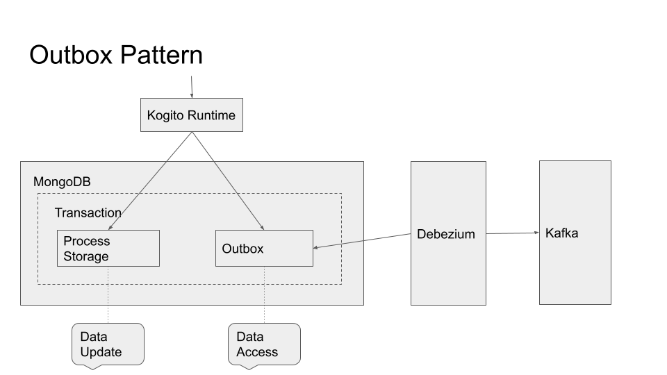

# Kogito with persistence and events strong consistency powered by Spring Boot, MongoDB, Debezium and Kafka

## Description

This example shows how to enable storing Kogito process data and events to MongoDB.

By doing so, it allows demonstrating how to use the outbox pattern with Debezium, which then reads these events and publishes to Kafka.

<p align="center"></p>

## Run the Example End-to-End

1. Deploy MongoDB, Debezium and Kafka
```shell
docker-compose up
```

5. Start MongoDB connector
```shell
curl -i -X POST -H "Accept:application/json" -H  "Content-Type:application/json" http://localhost:8083/connectors/ -d @debezium/register-mongodb.json
```

6. Access the database via MongoDB client if needed
```shell
docker-compose exec mongodb bash -c 'mongo -u $MONGODB_USER -p $MONGODB_PASSWORD --authenticationDatabase admin kogito'
```

7. Interact with the [Kogito App](#kogito-app-example-usage) (e.g. create an order) and generate some Kogito events

8. Consume messages from an event topic
```shell
docker-compose -f debezium/docker-compose-mongodb.yaml exec kafka /kafka/bin/kafka-console-consumer.sh \
    --bootstrap-server kafka:9092 \
    --from-beginning \
    --property print.key=false \
    --topic kogito-processinstances-events
```

9. With the Kafka broker info from step 8, run the Kogito Data Index Service with MongoDB to consume Kafka messages: https://github.com/kiegroup/kogito-runtimes/wiki/Data-Index-Service

10. Shut down the cluster
```shell
docker-compose -f debezium/docker-compose-mongodb.yaml down
```

## Kogito App Example Usage

Once the service is up and running, you can use the following examples to interact with the service.

### POST /orders

Allows to create a new order with the given data:

```sh
curl -d '{"approver" : "john", "order" : {"orderNumber" : "12345", "shipped" : false}}' -H "Content-Type: application/json" -X POST http://localhost:8080/orders
```
or on windows

```sh
curl -d "{\"approver\" : \"john\", \"order\" : {\"orderNumber\" : \"12345\", \"shipped\" : false}}" -H "Content-Type: application/json" -X POST http://localhost:8080/orders
```

As response the updated order is returned.

### GET /orders

Returns list of orders currently active:

```sh
curl -X GET http://localhost:8080/orders
```

As response an array of orders is returned.

### GET /orders/{id}

Returns order with given id (if active):

```sh
curl -X GET http://localhost:8080/orders/1
```

As response a single order is returned if found, otherwise 404 Not Found is returned.

### DELETE /orders/{id}

Cancels order with given id

```sh
curl -X DELETE http://localhost:8080/orders/1
```

### GET /orderItems

Getting order items sub processes

```sh
curl -X GET http://localhost:8080/orderItems
```
Example response:

```json
[
  {
    "id":"66c11e3e-c211-4cee-9a07-848b5e861bc5",
    "order":
    {
      "orderNumber":"12345",
      "shipped":false,
      "total":0.537941914075738
    }
  }
]
```

### GET /orderItems/{id}/tasks

Getting user tasks awaiting user action

```sh
curl -X GET http://localhost:8080/orderItems/66c11e3e-c211-4cee-9a07-848b5e861bc5/tasks?user=john
```
Example response:

```json
[
  {"id":"62f1c985-d31c-4ead-9906-2fe8d05937f0","name":"Verify order"}
]
```

### GET /orderItems/{id}/Verify_order/{tid}

Getting user task details

```sh
curl -X GET http://localhost:8080/orderItems/66c11e3e-c211-4cee-9a07-848b5e861bc5/Verify_order/62f1c985-d31c-4ead-9906-2fe8d05937f0?user=john
```
Example response:

```json
{
  "id":"62f1c985-d31c-4ead-9906-2fe8d05937f0",
  "input1":
  {
    "orderNumber":"12345",
    "shipped":false,
    "total":0.537941914075738
  },
  "name":"Verify order"
}
```

### POST /orderItems/{id}/Verify_order/{tid}

Complete user task

```sh
curl -d '{}' -H "Content-Type: application/json" -X POST http://localhost:8080/orderItems/66c11e3e-c211-4cee-9a07-848b5e861bc5/Verify_order/62f1c985-d31c-4ead-9906-2fe8d05937f0?user=john
```


As response the updated order is returned.

Example response:

```json
{
  "id":"66c11e3e-c211-4cee-9a07-848b5e861bc5",
  "order":
  {
    "orderNumber":"12345",
    "shipped":false,
    "total":0.537941914075738
  }
}
```

## References

**Outbox pattern**: https://debezium.io/blog/2019/02/19/reliable-microservices-data-exchange-with-the-outbox-pattern/

**debezium-examples:** https://github.com/debezium/debezium-examples/blob/master/tutorial/README.md#using-mongodb

**debezium-images:** https://github.com/debezium/docker-images/tree/master/examples/mongodb/
